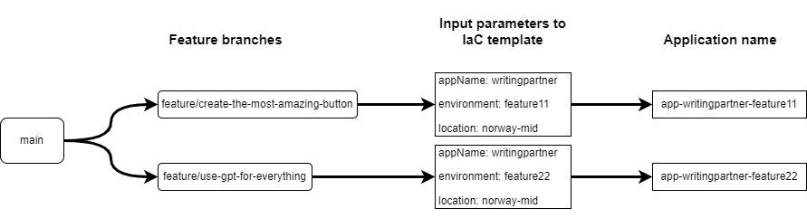

_This is a work in progress_

# Introduction
In this post, I will talk about how you can become more effective with Infrastructure as Code. I will talk about what IaC is, and why you should use it. I will assume that you are using a cloud provider, and not trying to script up you own datacenter and VMs from scratch. In this post, I will use bicep as examples, but the principle applies to others as well. 

# What is Infrastructure as Code(IaC)?
You probably already know this, or already have an idea about what it is. Nevertheless, to set the stage, let's start with a definition.

Infrastructure as Code is a way to automate the provisioning of infrastructure. In simple terms, it means that you write code to create and manage your infrastructure. This code ensures that your infrastructure is configured in a consistent way, and that it is reproducible. 

# Benefits of IaC?
## Automatic provisioning
The most obvious benefit of IaC is that it allows you to automate provision of infrastructure in a consistent and repeatable way. This is especially useful when you need to create multiple environments, such as dev, test and production. Also, if you need to create multiple resources of the same type, you can do this consistently and quickly.

Let's create a fictive example application. This application will consist of a frontend, hosted on a MVC and API backend. For simplicity, we will host both frontend and backend on the same backend. The backend will talk with a relational database, and store som binary data in blob storage. 

This is what a typical bicep file for this infrastructure would look like. 

```bicep 
param appName string
param environment string
param location string = resourceGroup().location

resource appService 'Microsoft.Web/sites@2020-06-01' = {
  name: 'app-${appName}-${environment}'
  location: location
  properties: {
    serverFarmId: appServicePlan.id
  }
}

resource sqlDatabase 'Microsoft.Sql/servers/databases@2020-02-02-preview' = {
  name: 'db-${appName}-${environment}'
  location: location
  parent: sqlServer
  [...]
}

resource storageAccount 'Microsoft.Storage/storageAccounts@2021-04-01' = {
  name: 'st${appName}${environment}'
  location: location
  [...]
}

resource sqlServer 'Microsoft.Sql/servers@2022-02-01-preview' existing = {
  [...]
}

resource appServicePlan 'Microsoft.Web/serverfarms@2020-06-01' = {
  [...]
}
```

_This is a simplification of what the actual bicep file would look like, but it is enough to illustrate the point_

You might say that is a huge wall of text, and where do i even start? Well, let's break it down. You have some input parameters at the top. These state the name of the application, the environment and where in the world it is deployed. Then you get to the big wall of text. If you take a quick glance at it, you can see that it is the resources in the infrastructure we talked about. You have an app service, a sql database, and a storage account. 

But wait! What are those two other resources at the bottom? Well, those are depencencies needed to deploy the infrastructure we want. In azure you have something called App Service Plan, which we very roughly just can say is the iron you are running you app service on. Then you have the database, this too has to be hosted on a server. That is why you have the sql server resource.

## Consistent configuration
Consistency is another great benefit of IaC. You can create templates for your infrastructure, and use these to create it in a consistent way. Let's say you need to create an api, and you need to configure it with a database, storage account and a key vault. If you created this with IaC, you can be sure that no matter how many times you provision it, it will be configured in the same way. 



From this diagram you can see that we have two feature branches. You could now easily and consistently create the same infrastructure for them, simply by changing the input parameters.

## Version control
A more subtle benefit of IaC is that you can and should store your IaC code in version control. This way you can track changes to your infrastructure, run code reviews, and even roll back to previous versions if needed. This leads to better quality, and a more stable infrastructure. 

Imagine making changes to your infrastructure, create a pull request, and then have an infrastructure engineer, architect, developer and/or a security engineer review your changes the same way as any other code. The infrastructure is no longer one lone wolf setting up the hardware and configuring it on his own. It is a team effort, and everyone can contribute.

## Documentation
As any developer knows, good and readable code is self documenting. This is also true for IaC. If you write readable IaC code, then you have questions about how your infrastructure is configured, you can just go back and look at the code.

Let's say you are a new developer on a project, and you are shown the bicep file from earlier. It is fast to which application it is and what dependencies it has. 

## Security
Setting up your IaC with security in mind is important. There are static analysis tools that can help you with this. One is [Checkov](https://www.checkov.io/). This tool can scan your IaC code, and give you feedback on how you can improve your security. (I am not affiliated with Checkov in any way, I just think it is a great tool).

Other than that, when making your IaC templates you can use [managed identity](https://learn.microsoft.com/en-us/azure/active-directory/managed-identities-azure-resources/overview) and role based access to ensure that only your application has access to the resources it needs, and not any other applications or resource. The way this works is that you create a managed identity for your application, and then give that identity the permissions it needs to access the resources it needs.

Building on previous example, we can not add a managed identity to the app service, and give it access to the database and storage account.

```bicep


[comment]: <> (example - Talk about when we spent days on finding the problem with logging then igure out that it was one flag in IIS named load user profiles that should have been on. - unable to load certificates from the certificate store. - take screen shots of each step needed to find that setting.)
